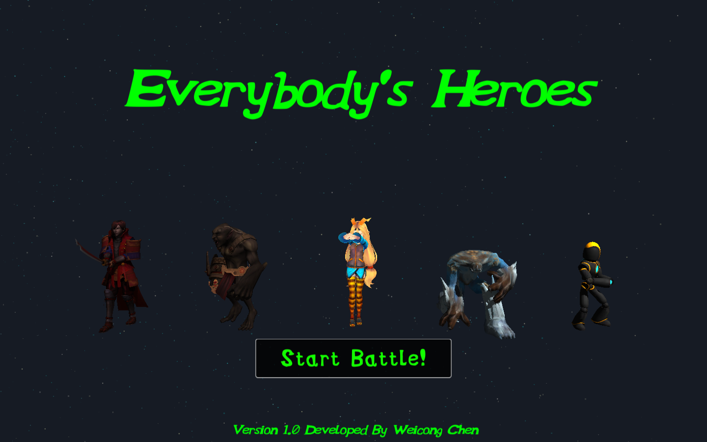
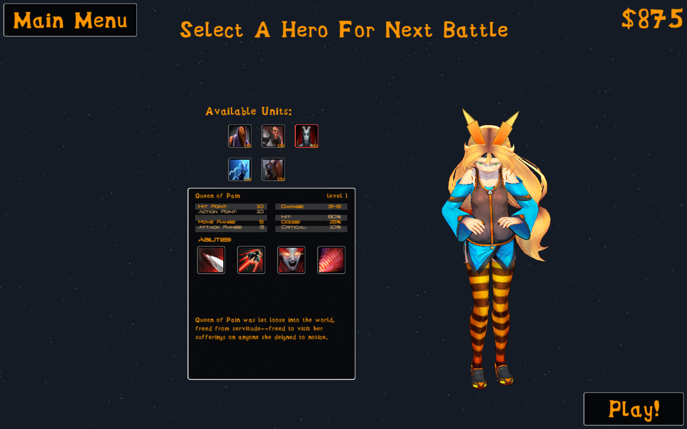
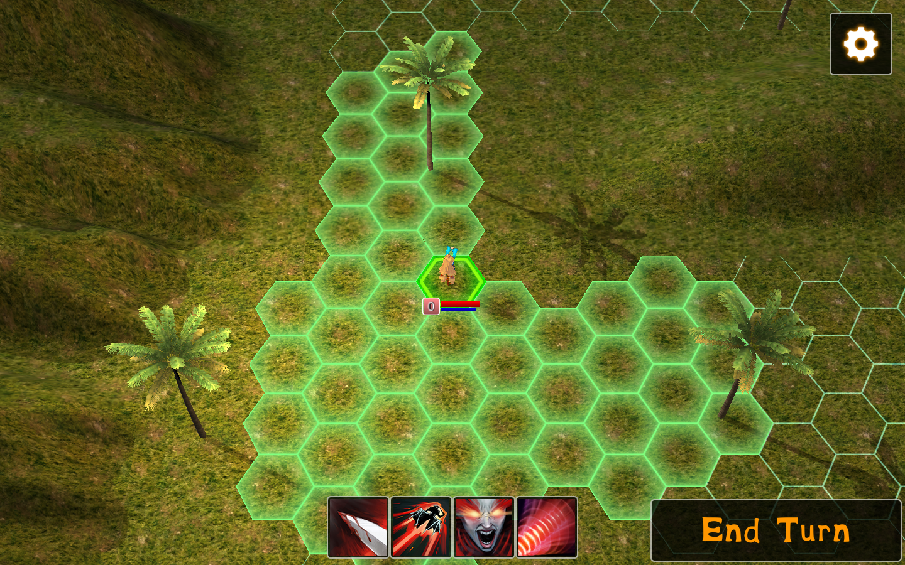
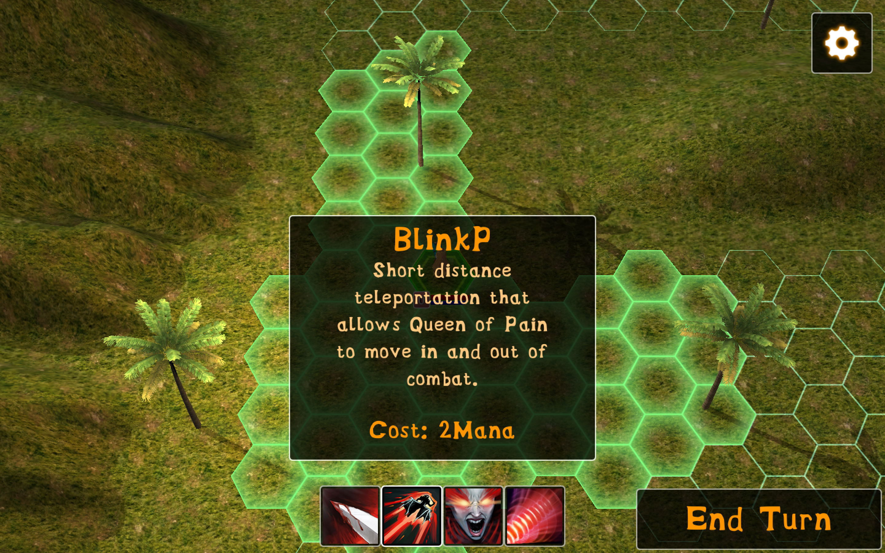
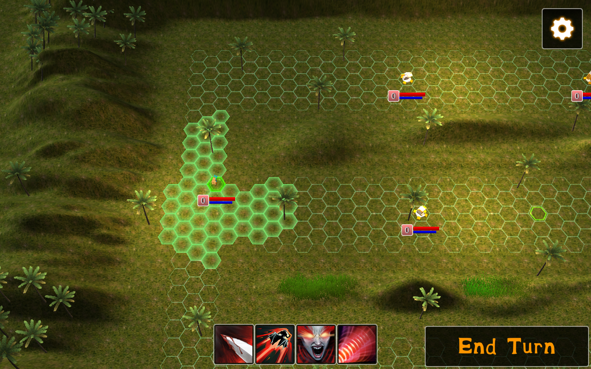
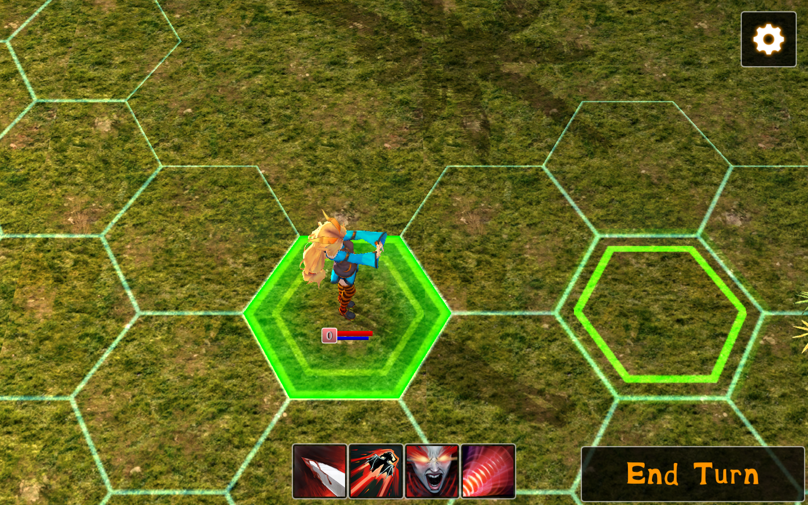
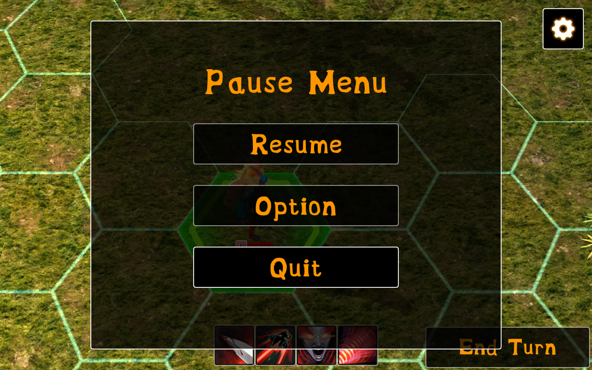

# Everybodys-Heroes

Everybody’s Heroes is an Android multiplayer battle game redeveloped from the famous PC video game DotA2. It inherits DotA2’s classic background setting and great features, while making significant modifications to lower the playing difficulty as well as to adapt it to Android devices. Everybody’s Heroes offers comparable fun to DotA2. Meanwhile, it benefits from the advantages of mobile devices, enabling more people to enjoy this game anywhere at any time.

